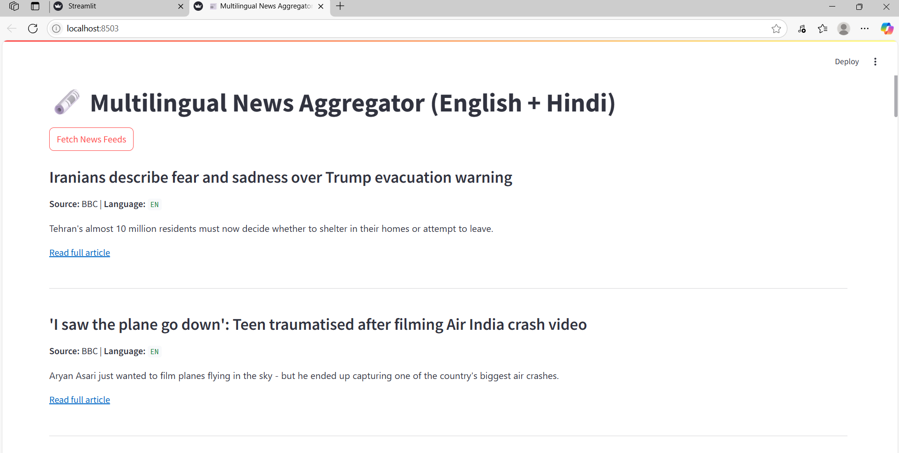
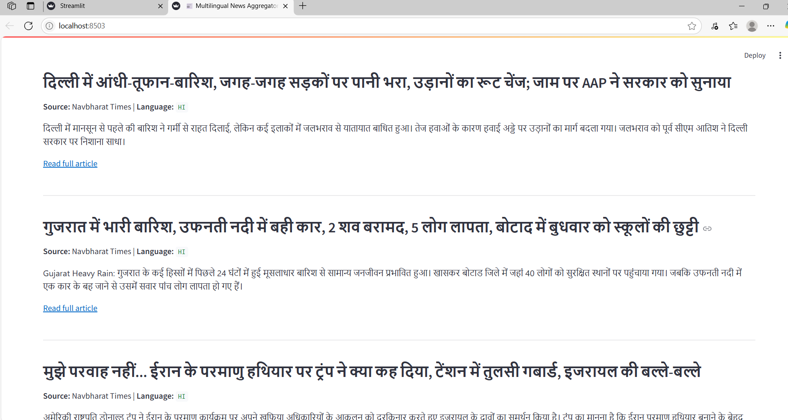
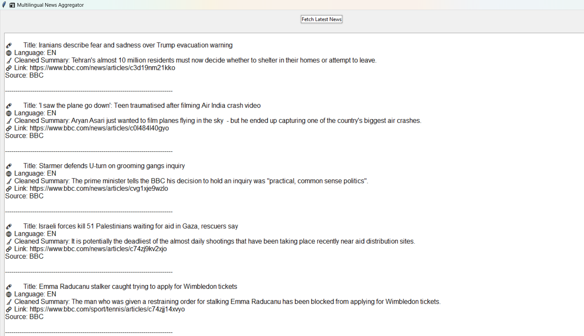
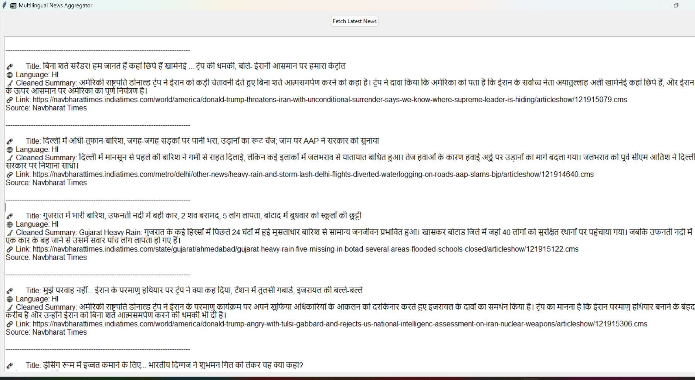

# 📰 Multilingual News Aggregator

A Python project that fetches and cleans RSS news feeds in both English and Hindi. Includes:

- 🖥️ GUI (Tkinter)
- 🌐 Web app (Streamlit)

## 🔧 Features

- Detects language (English / Hindi)
- Cleans stopwords and punctuation
- Fetches news from BBC, NDTV, and Navbharat Times
- Displays clean summaries and source info

## 🚀 How to Run

Install required packages:

```bash
pip install -r requirements.txt

pip install -r requirements.txt

## 🖥️ Output Screenshots


### ✅ Streamlit Web Output



### ✅ Tkinter GUI Output




